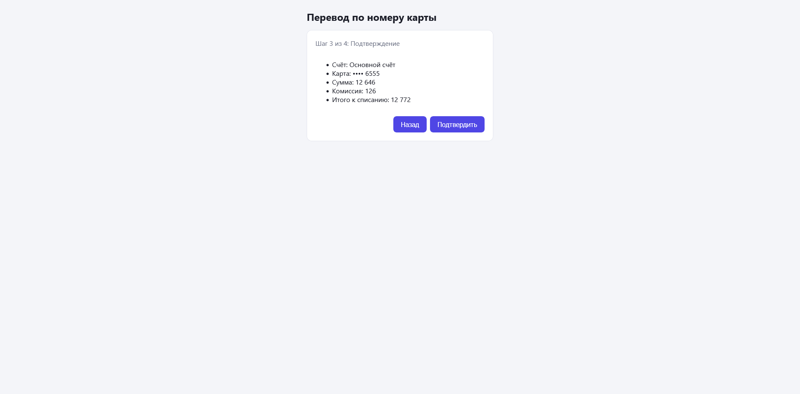

# Перевод по номеру карты

Многошаговая форма перевода с валидацией, комиссией и подтверждением по SMS-коду.

**Демо:** https://transfer-form-psi.vercel.app/



## Возможности

- 4 шага: счёт и карта, сумма, подтверждение, код из SMS
- Валидация на каждом шаге (zod + react-hook-form)
- Ввод только цифр, сумма отображается с пробелами (10 000)
- Комиссия 1% и итоговая сумма списания
- Проверка баланса с учётом комиссии
- Обработка ошибок API (недостаточно средств, неверный код)
- Блокировка после 3 неверных кодов
- Unit-тесты на схему валидации и расчёт комиссии

## Стек

React, TypeScript, Vite, react-hook-form, zod, Vitest

## Запуск

```bash
npm install
npm run dev
npm test
```

## Структура

- `src/lib/schema.ts` — схема валидации
- `src/lib/fee.ts` — расчёт комиссии
- `src/lib/api.ts` — фейковый банковский API
- `src/components/TransferWizard.tsx` — многошаговая форма